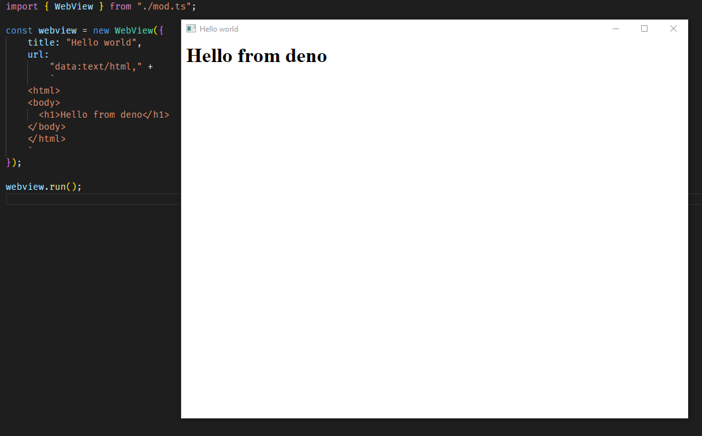

# deno_webview

[](https://github.com/eliassjogreen/deno_webview/blob/master/LICENSE)
[](https://github.com/eliassjogreen/deno_webview/stargazers)
[](https://github.com/eliassjogreen/deno_webview/issues)
[](https://github.com/eliassjogreen/deno_webview/actions)
[](https://github.com/eliassjogreen/deno_webview/releases/latest/)
[](https://github.com/denoland/deno)
[](https://doc.deno.land/https/deno.land/x/webview/mod.ts)

This project provides [deno](https://github.com/denoland/deno) bindings for
[webview](https://github.com/zserge/webview) using the
[webview rust bindings](https://github.com/Boscop/web-view). Webview is a tiny
cross-platform library to render web-based GUIs for desktop applications. This
project is still in an early stage of development and stability is sometimes
questionable. The plugin should be compatible with MacOS (recently ran into some
problems, but cannot solve the problem myself as i do not have acces to a mac),
Linux and Windows. It has been tested on Windows and Xubuntu where it worked as
expected using the latest versions of deno. The current goal of deno_webview is
to provide high quality bindings to webview for creating light cross-platform
applications using web technologies.



## Example

Run the following with the `-A` and `--unstable` flags enabled to get the example shown above:

```ts
import { WebView } from "https://deno.land/x/webview/mod.ts";

const webview1 = new WebView({
  title: "Multiple deno_webview example",
  url: `data:text/html,
    <html>
    <body>
      <h1>1</h1>
    </body>
    </html>
    `,
  width: 800,
  height: 600,
  resizable: true,
  debug: true,
  frameless: false,
});

const webview2 = new WebView({
  title: "Multiple deno_webview example",
  url: `data:text/html,
    <html>
    <body>
      <h1>2</h1>
    </body>
    </html>
    `,
  width: 800,
  height: 600,
  resizable: true,
  debug: true,
  frameless: false,
});

await Promise.all([webview1.run(), webview2.run()]);
```

or just run the following in the terminal:

```
deno run -A --unstable https://deno.land/x/webview/examples/multiple.ts
```

## Docs

Docs can be found
[here](https://doc.deno.land/https/deno.land/x/webview/mod.ts).

## Development

### Prerequisites

For building deno_webview the same
[prerequisites](https://deno.land/std/manual.md#prerequisites) as for building
deno is required (mostly).

#### Linux

-   [webkit2gtk](https://webkitgtk.org/) (to install using apt:
    `sudo apt-get install libwebkit2gtk-4.0-dev`)

### Cloning

To clone the repo simply run the following:

```

git clone https://github.com/eliassjogreen/deno_webview.git

```

and then cd into the repo:

```

cd deno_webview

```

### Building

Building deno_webview takes about 20-50 minutes the first time (then like a
minute) depending on your operating system. When building on Windows admin is
required. Building is easiest done by running:

```

deno -A scripts/build.ts

```

or

```

cargo build --release --locked

```

optionally with mshtml

```

deno -A scripts/build.ts mshtml

```

or

```

cargo build --release --locked --no-default-features

```

### Running

To run deno_webview without automatically downloading the binaries from
[releases](https://github.com/eliassjogreen/deno_webview/releases) you will need
to use the enviornment variable `DEV` and set it to the path where the binaries
are located. This is usually `file://./target/release`. The process of running a
using local binaries can be easier to do using the
[dev script](https://github.com/eliassjogreen/deno_webview/tree/master/scripts/dev.ts):

```
deno -A scripts/dev.ts example.ts
```

## Environment variables

-   `DEV` - When developing locally `DEV` should be set to the local release
    path, usually `file://./target/release`
-   `MSHTML` - Due to MSHTML (ie) no longer being enabled by default the only
    way to enable it is to set the `MSHTML` variable to the path of a binary
    build built with the `--no-default-features` flag or using
    `deno -A scripts/build.ts mshtml`

## Contributing

Contributions either in the form of pull requests or issues are always welcome.
Just remember to format using `deno -A scripts/fmt.ts` (`deno fmt` and
`cargo fmt`). Thx <3

## Dependencies

### Deno

-   [plugin_prepare](https://deno.land/x/plugin_prepare)

### Rust

-   [deno_core](https://crates.io/crates/deno_core)
-   [webview-sys](https://crates.io/crates/webview-sys)
-   [serde](https://crates.io/crates/serde)
-   [serde_json](https://crates.io/crates/serde_json)

## Todo

-   [x] Implement ~~all~~ most webview
        [instance methods](https://docs.rs/web-view/0.6.0/web_view/struct.WebView.html)
-   [x] Docs
-   [x] Multiple windows/instances? ~~(Help, need to create a static HashMap of
        `*mut CWebView`)~~ Used solution found
        [here](https://github.com/crabmusket/deno_sqlite_plugin/blob/2df9e495f34d246881de0b48c9c79cc9e271abeb/src/lib.rs#L18)
-   [x] Better errors and responses from rust land
-   [x] Update ci so building with Edge works
        [#3](https://github.com/eliassjogreen/deno_webview/issues/3)
-   [ ] Two-way deno bindings (to call deno from javascript)
-   [ ] More examples
-   [ ] Tests (unsure of how though also [#4670](https://github.com/denoland/deno/issues/4670))
-   [ ] Wait for the [rust bindings](https://github.com/Boscop/web-view) to
        update to the latest [webview](https://github.com/zserge/webview) api.
    -   [ ] Polyfill for new API?
