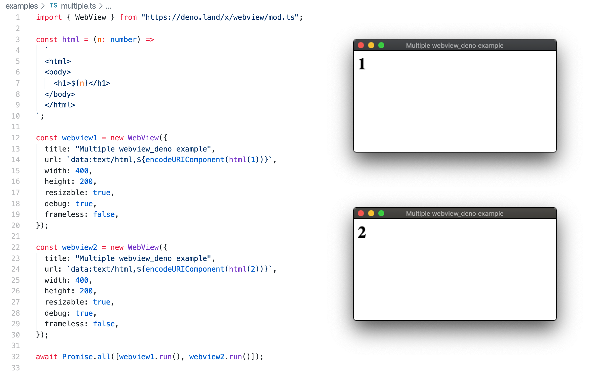

# webview_deno

[](https://github.com/webview/webview_deno/stargazers)
[](https://github.com/webview/webview_deno/issues)
[](https://github.com/webview/webview_deno/actions)
[](https://github.com/webview/webview_deno/releases/latest/)
[](https://github.com/denoland/deno)
[](https://doc.deno.land/https/deno.land/x/webview/mod.ts)
[![license](https://img.shields.io/github/license/webview/webview_deno?logo=data:image/png;base64,iVBORw0KGgoAAAANSUhEUgAAABwAAAAcCAYAAAEFCu8CAAAABGdBTUEAALGPC/xhBQAAADhlWElmTU0AKgAAAAgAAYdpAAQAAAABAAAAGgAAAAAAAqACAAQAAAABAAAAHKADAAQAAAABAAAAHAAAAABHddaYAAAC5UlEQVRIDd2WPWtVQRCGby5pVASLiGghQSxyG8Ui2KWwCfkH9olY2JneQkiR0oCIxH/gB+qVFDYBIWBAbAIRSbCRpLXwIxLiPT7vnNm9e87ZxJtUwYH3zO47Mzv7Mbv3tlo5KYriGtgAJ81OY1ENdG/YI4boFEOI911BXgY/pdtwGuAtXpvmB1tAXHDnUolE5urkPOQo6MqA3pXWmJJL4Bb4rQ7yEYfxsjnIF29NJIoNC6e5fxOL/qN+9KCz7AaLpN8zI415N2i2EptpGrkRIjGeAuvR6IY1hSFLFUOug9Ms2M7ZxIUNytm1mnME186sdI2BOCwAyQMg54ugzSmKmwbPwSbolKH+hbAtQdsOoF+BsF3anUVwBdiOWRidFZDKTTrKEAJTm3GVrGkHzw/uPZbyx7DNNLfB7KGmRsCcr+/gjaiPSpAOTyX9qG4L/XBDdWXDDf1M+wtQ5fwCOtcb4Dto6VpLmzByB6gqdHbTItGSJdAGqibJQhmRfCF7IN4beSF2G9CqnGXQrxofXU+EykllNeoczRgYytDKMubDIRK0g5MF8rE69cGu0u9nlUcqaUZ41W0qK2nGcSzr4D2wV9U9wxp1rnpxn8agXAOHMQ9cy9kbHM7ngY4gFb03TxrO/yfBUifTtXt78jCrjY/jgEFnMn45LuNWUtknuu7NSm7D3QEn3HbatV1Q2jvgIRf1sfODKQaeymxZoMLlTqsq1LF+HvaTqQOzEzUCfni0/eNIA+DfuE3KEtbsegckGmMktTXacnBHPVe687ugkpT+axCkkhBSyRSjWI2xf1KMMVmYiQdWksK9BEFiQoiYLIlvJA3/zeTzCejP0RbB6YPbhZuB+0pR3KcdX0LaJtju0ZgBL8Bd+sbz2QIaU2OfBX3BaQLsgZysQtrk0M8Sh1A0w3DyyYnGnAiZ4gqZ/TvI2A8OGd1YIbF7+F3P+B6dYpYdsJNZgrjO0UdOIhmom0nwL0pnfnzkL1803jAoKhvyAAAAAElFTkSuQmCC)](https://github.com/webview/webview_deno/blob/master/LICENSE)

[deno](https://github.com/denoland/deno) bindings for
[webview](https://github.com/webview/webview)

Webview is a tiny cross-platform library to make **web-based GUIs for desktop
applications**.

---

> ⚠️ This project is still in development. Expect breaking changes.

---



## Example

```typescript
import { Webview } from "https://deno.land/x/webview/mod.ts";

const html = `
  <html>
  <body>
    <h1>Hello from deno v${Deno.version.deno}</h1>
  </body>
  </html>
`;

const webview = new Webview();

webview.navigate(`data:text/html,${encodeURIComponent(html)}`);
webview.run();
```

You can run this example directly from the web:

```bash
deno run -Ar --unstable https://deno.land/x/webview/examples/local.ts
```

or in your development environment:

```bash
deno run -Ar --unstable examples/local.ts
```

you can find other examples in the [`examples/`](examples) directory.

## Documentation

You can find the official documentation
[here](https://doc.deno.land/https/deno.land/x/webview/mod.ts).

## Development

### Prerequisites

#### Linux

- [webkit2gtk](https://webkitgtk.org/) (to install using apt:
  `sudo apt-get install libwebkit2gtk-4.0-dev`)

### Building

Make sure to init the webview submodule with:

```bash
$ git submodule update --init --recursive
```

Building on Windows requires admin privileges.

```bash
$ deno task build
```

### Running

To run webview_deno without automatically downloading the binaries from
[releases](https://github.com/webview/webview_deno/releases) you will need to
use the environment variable `PLUGIN_URL` and set it to the path where the built
binaries are located. This is usually `file://./target/release`.

```bash
$ deno task build
$ PLUGIN_URL=./build/
$ deno run --unstable -A examples/local.ts
```

or

```bash
$ deno task run examples/local.ts
```

or if you have the webview library already built and didn't make any changes to
it, you can skip the building step with:

```bash
$ deno task run:fast examples/local.ts
```

## Environment variables

- `PLUGIN_URL` - Set a custom library URL. Defaults to the latest release assets
  on Github. Setting this also disables cache for `plug`.

## Dependencies

- [plug](https://deno.land/x/plug)
- [webview](https://github.com/webview/webview)

## Other

### Contribution

Pull request, issues and feedback are very welcome. Code style is formatted with
`deno task fmt`, linted with `deno task lint` and commit messages are done
following [Conventional Commits](https://www.conventionalcommits.org/en/v1.0.0/)
spec.

### Licence

Copyright 2020-2022, the webview_deno team. All rights reserved. MIT license.
